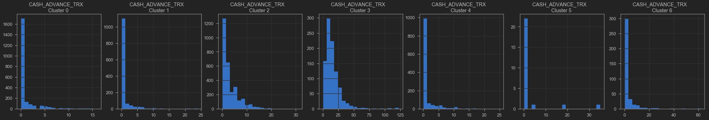

# TASK #1: UNDERSTAND THE PROBLEM STATEMENT AND BUSINESS CASE


Data Source: https://www.kaggle.com/arjunbhasin2013/ccdata

***Project Structure***

The hands on project on Unsupervised Machine Learning for Customer Segmentation is divided into following tasks:

Task 1: Understand the problem statement and business case

Task 2: Import libraries and datasets

Task 3: Visualize and explore datasets

Task 4: Understand the theory and intuition behind k-means clustering machine learning algorithm

Task 5: Learn how to obtain the optimal number of clusters using the elbow method

Task 6: Use Scikit-Learn library to find the optimal number of clusters using elbow method

Task 7: Apply k-means using Scikit-Learn to perform customer segmentation

Task 8: Apply Principal Component Analysis (PCA) technique to perform dimensionality reduction and data visualization

# TASK #2: IMPORT LIBRARIES AND DATASETS


```python
import pandas as pd
import numpy as np
import seaborn as sns
import matplotlib.pyplot as plt
from sklearn.preprocessing import StandardScaler, normalize
from sklearn.cluster import KMeans
from sklearn.decomposition import PCA
from jupyterthemes import jtplot
jtplot.style(theme='monokai', context='notebook', ticks=True, grid=False) 
# setting the style of the notebook to be monokai theme  
# this line of code is important to ensure that we are able to see the x and y axes clearly
# If you don't run this code line, you will notice that the xlabel and ylabel on any plot is black on black and it will be hard to see them. 

```


```python
# You have to include the full link to the csv file containing your dataset
creditcard_df = pd.read_csv('Marketing_data.csv')

# CUSTID: Identification of Credit Card holder 
# BALANCE: Balance amount left in customer's account to make purchases
# BALANCE_FREQUENCY: How frequently the Balance is updated, score between 0 and 1 (1 = frequently updated, 0 = not frequently updated)
# PURCHASES: Amount of purchases made from account
# ONEOFFPURCHASES: Maximum purchase amount done in one-go
# INSTALLMENTS_PURCHASES: Amount of purchase done in installment
# CASH_ADVANCE: Cash in advance given by the user
# PURCHASES_FREQUENCY: How frequently the Purchases are being made, score between 0 and 1 (1 = frequently purchased, 0 = not frequently purchased)
# ONEOFF_PURCHASES_FREQUENCY: How frequently Purchases are happening in one-go (1 = frequently purchased, 0 = not frequently purchased)
# PURCHASES_INSTALLMENTS_FREQUENCY: How frequently purchases in installments are being done (1 = frequently done, 0 = not frequently done)
# CASH_ADVANCE_FREQUENCY: How frequently the cash in advance being paid
# CASH_ADVANCE_TRX: Number of Transactions made with "Cash in Advance"
# PURCHASES_TRX: Number of purchase transactions made
# CREDIT_LIMIT: Limit of Credit Card for user
# PAYMENTS: Amount of Payment done by user
# MINIMUM_PAYMENTS: Minimum amount of payments made by user  
# PRC_FULL_PAYMENT: Percent of full payment paid by user
# TENURE: Tenure of credit card service for user
```


```python
creditcard_df
```


<div>
<style scoped>
    .dataframe tbody tr th:only-of-type {
        vertical-align: middle;
    }

    .dataframe tbody tr th {
        vertical-align: top;
    }

    .dataframe thead th {
        text-align: right;
    }
</style>
<table border="1" class="dataframe">
  <thead>
    <tr style="text-align: right;">
      <th></th>
      <th>CUST_ID</th>
      <th>BALANCE</th>
      <th>BALANCE_FREQUENCY</th>
      <th>PURCHASES</th>
      <th>ONEOFF_PURCHASES</th>
      <th>INSTALLMENTS_PURCHASES</th>
      <th>CASH_ADVANCE</th>
      <th>PURCHASES_FREQUENCY</th>
      <th>ONEOFF_PURCHASES_FREQUENCY</th>
      <th>PURCHASES_INSTALLMENTS_FREQUENCY</th>
      <th>CASH_ADVANCE_FREQUENCY</th>
      <th>CASH_ADVANCE_TRX</th>
      <th>PURCHASES_TRX</th>
      <th>CREDIT_LIMIT</th>
      <th>PAYMENTS</th>
      <th>MINIMUM_PAYMENTS</th>
      <th>PRC_FULL_PAYMENT</th>
      <th>TENURE</th>
    </tr>
  </thead>
  <tbody>
    <tr>
      <th>0</th>
      <td>C10001</td>
      <td>40.900749</td>
      <td>0.818182</td>
      <td>95.40</td>
      <td>0.00</td>
      <td>95.40</td>
      <td>0.000000</td>
      <td>0.166667</td>
      <td>0.000000</td>
      <td>0.083333</td>
      <td>0.000000</td>
      <td>0</td>
      <td>2</td>
      <td>1000.0</td>
      <td>201.802084</td>
      <td>139.509787</td>
      <td>0.000000</td>
      <td>12</td>
    </tr>
    <tr>
      <th>1</th>
      <td>C10002</td>
      <td>3202.467416</td>
      <td>0.909091</td>
      <td>0.00</td>
      <td>0.00</td>
      <td>0.00</td>
      <td>6442.945483</td>
      <td>0.000000</td>
      <td>0.000000</td>
      <td>0.000000</td>
      <td>0.250000</td>
      <td>4</td>
      <td>0</td>
      <td>7000.0</td>
      <td>4103.032597</td>
      <td>1072.340217</td>
      <td>0.222222</td>
      <td>12</td>
    </tr>
    <tr>
      <th>2</th>
      <td>C10003</td>
      <td>2495.148862</td>
      <td>1.000000</td>
      <td>773.17</td>
      <td>773.17</td>
      <td>0.00</td>
      <td>0.000000</td>
      <td>1.000000</td>
      <td>1.000000</td>
      <td>0.000000</td>
      <td>0.000000</td>
      <td>0</td>
      <td>12</td>
      <td>7500.0</td>
      <td>622.066742</td>
      <td>627.284787</td>
      <td>0.000000</td>
      <td>12</td>
    </tr>
    <tr>
      <th>3</th>
      <td>C10004</td>
      <td>1666.670542</td>
      <td>0.636364</td>
      <td>1499.00</td>
      <td>1499.00</td>
      <td>0.00</td>
      <td>205.788017</td>
      <td>0.083333</td>
      <td>0.083333</td>
      <td>0.000000</td>
      <td>0.083333</td>
      <td>1</td>
      <td>1</td>
      <td>7500.0</td>
      <td>0.000000</td>
      <td>NaN</td>
      <td>0.000000</td>
      <td>12</td>
    </tr>
    <tr>
      <th>4</th>
      <td>C10005</td>
      <td>817.714335</td>
      <td>1.000000</td>
      <td>16.00</td>
      <td>16.00</td>
      <td>0.00</td>
      <td>0.000000</td>
      <td>0.083333</td>
      <td>0.083333</td>
      <td>0.000000</td>
      <td>0.000000</td>
      <td>0</td>
      <td>1</td>
      <td>1200.0</td>
      <td>678.334763</td>
      <td>244.791237</td>
      <td>0.000000</td>
      <td>12</td>
    </tr>
    <tr>
      <th>...</th>
      <td>...</td>
      <td>...</td>
      <td>...</td>
      <td>...</td>
      <td>...</td>
      <td>...</td>
      <td>...</td>
      <td>...</td>
      <td>...</td>
      <td>...</td>
      <td>...</td>
      <td>...</td>
      <td>...</td>
      <td>...</td>
      <td>...</td>
      <td>...</td>
      <td>...</td>
      <td>...</td>
    </tr>
    <tr>
      <th>8945</th>
      <td>C19186</td>
      <td>28.493517</td>
      <td>1.000000</td>
      <td>291.12</td>
      <td>0.00</td>
      <td>291.12</td>
      <td>0.000000</td>
      <td>1.000000</td>
      <td>0.000000</td>
      <td>0.833333</td>
      <td>0.000000</td>
      <td>0</td>
      <td>6</td>
      <td>1000.0</td>
      <td>325.594462</td>
      <td>48.886365</td>
      <td>0.500000</td>
      <td>6</td>
    </tr>
    <tr>
      <th>8946</th>
      <td>C19187</td>
      <td>19.183215</td>
      <td>1.000000</td>
      <td>300.00</td>
      <td>0.00</td>
      <td>300.00</td>
      <td>0.000000</td>
      <td>1.000000</td>
      <td>0.000000</td>
      <td>0.833333</td>
      <td>0.000000</td>
      <td>0</td>
      <td>6</td>
      <td>1000.0</td>
      <td>275.861322</td>
      <td>NaN</td>
      <td>0.000000</td>
      <td>6</td>
    </tr>
    <tr>
      <th>8947</th>
      <td>C19188</td>
      <td>23.398673</td>
      <td>0.833333</td>
      <td>144.40</td>
      <td>0.00</td>
      <td>144.40</td>
      <td>0.000000</td>
      <td>0.833333</td>
      <td>0.000000</td>
      <td>0.666667</td>
      <td>0.000000</td>
      <td>0</td>
      <td>5</td>
      <td>1000.0</td>
      <td>81.270775</td>
      <td>82.418369</td>
      <td>0.250000</td>
      <td>6</td>
    </tr>
    <tr>
      <th>8948</th>
      <td>C19189</td>
      <td>13.457564</td>
      <td>0.833333</td>
      <td>0.00</td>
      <td>0.00</td>
      <td>0.00</td>
      <td>36.558778</td>
      <td>0.000000</td>
      <td>0.000000</td>
      <td>0.000000</td>
      <td>0.166667</td>
      <td>2</td>
      <td>0</td>
      <td>500.0</td>
      <td>52.549959</td>
      <td>55.755628</td>
      <td>0.250000</td>
      <td>6</td>
    </tr>
    <tr>
      <th>8949</th>
      <td>C19190</td>
      <td>372.708075</td>
      <td>0.666667</td>
      <td>1093.25</td>
      <td>1093.25</td>
      <td>0.00</td>
      <td>127.040008</td>
      <td>0.666667</td>
      <td>0.666667</td>
      <td>0.000000</td>
      <td>0.333333</td>
      <td>2</td>
      <td>23</td>
      <td>1200.0</td>
      <td>63.165404</td>
      <td>88.288956</td>
      <td>0.000000</td>
      <td>6</td>
    </tr>
  </tbody>
</table>
<p>8950 rows × 18 columns</p>
</div>


```python
# Let's apply info and get additional insights on our dataframe
creditcard_df.info()
# 18 features with 8950 points  
```

    <class 'pandas.core.frame.DataFrame'>
    RangeIndex: 8950 entries, 0 to 8949
    Data columns (total 18 columns):
     #   Column                            Non-Null Count  Dtype  
    ---  ------                            --------------  -----  
     0   CUST_ID                           8950 non-null   object 
     1   BALANCE                           8950 non-null   float64
     2   BALANCE_FREQUENCY                 8950 non-null   float64
     3   PURCHASES                         8950 non-null   float64
     4   ONEOFF_PURCHASES                  8950 non-null   float64
     5   INSTALLMENTS_PURCHASES            8950 non-null   float64
     6   CASH_ADVANCE                      8950 non-null   float64
     7   PURCHASES_FREQUENCY               8950 non-null   float64
     8   ONEOFF_PURCHASES_FREQUENCY        8950 non-null   float64
     9   PURCHASES_INSTALLMENTS_FREQUENCY  8950 non-null   float64
     10  CASH_ADVANCE_FREQUENCY            8950 non-null   float64
     11  CASH_ADVANCE_TRX                  8950 non-null   int64  
     12  PURCHASES_TRX                     8950 non-null   int64  
     13  CREDIT_LIMIT                      8949 non-null   float64
     14  PAYMENTS                          8950 non-null   float64
     15  MINIMUM_PAYMENTS                  8637 non-null   float64
     16  PRC_FULL_PAYMENT                  8950 non-null   float64
     17  TENURE                            8950 non-null   int64  
    dtypes: float64(14), int64(3), object(1)
    memory usage: 1.2+ MB
    

MINI CHALLENGE #1: 
 - What is the average, minimum and maximum "BALANCE" amount?


```python
print('The average, minimum and maximum balance amount is', creditcard_df['BALANCE'].mean(),creditcard_df['BALANCE'].min(),creditcard_df['BALANCE'].max())
```

    The average, minimum and maximum balance amount is 1564.4748276781038 0.0 19043.13856
    


```python
# Let's apply describe() and get more statistical insights on our dataframe
# Mean balance is $1564 
# Balance frequency is frequently updated on average ~0.9
# Purchases average is $1000
# one off purchase average is ~$600
# Average purchases frequency is around 0.5
# average ONEOFF_PURCHASES_FREQUENCY, PURCHASES_INSTALLMENTS_FREQUENCY, and CASH_ADVANCE_FREQUENCY are generally low
# Average credit limit ~ 4500
# Percent of full payment is 15%
# Average tenure is 11 years
```


```python
creditcard_df.describe()
```


<div>
<style scoped>
    .dataframe tbody tr th:only-of-type {
        vertical-align: middle;
    }

    .dataframe tbody tr th {
        vertical-align: top;
    }

    .dataframe thead th {
        text-align: right;
    }
</style>
<table border="1" class="dataframe">
  <thead>
    <tr style="text-align: right;">
      <th></th>
      <th>BALANCE</th>
      <th>BALANCE_FREQUENCY</th>
      <th>PURCHASES</th>
      <th>ONEOFF_PURCHASES</th>
      <th>INSTALLMENTS_PURCHASES</th>
      <th>CASH_ADVANCE</th>
      <th>PURCHASES_FREQUENCY</th>
      <th>ONEOFF_PURCHASES_FREQUENCY</th>
      <th>PURCHASES_INSTALLMENTS_FREQUENCY</th>
      <th>CASH_ADVANCE_FREQUENCY</th>
      <th>CASH_ADVANCE_TRX</th>
      <th>PURCHASES_TRX</th>
      <th>CREDIT_LIMIT</th>
      <th>PAYMENTS</th>
      <th>MINIMUM_PAYMENTS</th>
      <th>PRC_FULL_PAYMENT</th>
      <th>TENURE</th>
    </tr>
  </thead>
  <tbody>
    <tr>
      <th>count</th>
      <td>8950.000000</td>
      <td>8950.000000</td>
      <td>8950.000000</td>
      <td>8950.000000</td>
      <td>8950.000000</td>
      <td>8950.000000</td>
      <td>8950.000000</td>
      <td>8950.000000</td>
      <td>8950.000000</td>
      <td>8950.000000</td>
      <td>8950.000000</td>
      <td>8950.000000</td>
      <td>8949.000000</td>
      <td>8950.000000</td>
      <td>8637.000000</td>
      <td>8950.000000</td>
      <td>8950.000000</td>
    </tr>
    <tr>
      <th>mean</th>
      <td>1564.474828</td>
      <td>0.877271</td>
      <td>1003.204834</td>
      <td>592.437371</td>
      <td>411.067645</td>
      <td>978.871112</td>
      <td>0.490351</td>
      <td>0.202458</td>
      <td>0.364437</td>
      <td>0.135144</td>
      <td>3.248827</td>
      <td>14.709832</td>
      <td>4494.449450</td>
      <td>1733.143852</td>
      <td>864.206542</td>
      <td>0.153715</td>
      <td>11.517318</td>
    </tr>
    <tr>
      <th>std</th>
      <td>2081.531879</td>
      <td>0.236904</td>
      <td>2136.634782</td>
      <td>1659.887917</td>
      <td>904.338115</td>
      <td>2097.163877</td>
      <td>0.401371</td>
      <td>0.298336</td>
      <td>0.397448</td>
      <td>0.200121</td>
      <td>6.824647</td>
      <td>24.857649</td>
      <td>3638.815725</td>
      <td>2895.063757</td>
      <td>2372.446607</td>
      <td>0.292499</td>
      <td>1.338331</td>
    </tr>
    <tr>
      <th>min</th>
      <td>0.000000</td>
      <td>0.000000</td>
      <td>0.000000</td>
      <td>0.000000</td>
      <td>0.000000</td>
      <td>0.000000</td>
      <td>0.000000</td>
      <td>0.000000</td>
      <td>0.000000</td>
      <td>0.000000</td>
      <td>0.000000</td>
      <td>0.000000</td>
      <td>50.000000</td>
      <td>0.000000</td>
      <td>0.019163</td>
      <td>0.000000</td>
      <td>6.000000</td>
    </tr>
    <tr>
      <th>25%</th>
      <td>128.281915</td>
      <td>0.888889</td>
      <td>39.635000</td>
      <td>0.000000</td>
      <td>0.000000</td>
      <td>0.000000</td>
      <td>0.083333</td>
      <td>0.000000</td>
      <td>0.000000</td>
      <td>0.000000</td>
      <td>0.000000</td>
      <td>1.000000</td>
      <td>1600.000000</td>
      <td>383.276166</td>
      <td>169.123707</td>
      <td>0.000000</td>
      <td>12.000000</td>
    </tr>
    <tr>
      <th>50%</th>
      <td>873.385231</td>
      <td>1.000000</td>
      <td>361.280000</td>
      <td>38.000000</td>
      <td>89.000000</td>
      <td>0.000000</td>
      <td>0.500000</td>
      <td>0.083333</td>
      <td>0.166667</td>
      <td>0.000000</td>
      <td>0.000000</td>
      <td>7.000000</td>
      <td>3000.000000</td>
      <td>856.901546</td>
      <td>312.343947</td>
      <td>0.000000</td>
      <td>12.000000</td>
    </tr>
    <tr>
      <th>75%</th>
      <td>2054.140036</td>
      <td>1.000000</td>
      <td>1110.130000</td>
      <td>577.405000</td>
      <td>468.637500</td>
      <td>1113.821139</td>
      <td>0.916667</td>
      <td>0.300000</td>
      <td>0.750000</td>
      <td>0.222222</td>
      <td>4.000000</td>
      <td>17.000000</td>
      <td>6500.000000</td>
      <td>1901.134317</td>
      <td>825.485459</td>
      <td>0.142857</td>
      <td>12.000000</td>
    </tr>
    <tr>
      <th>max</th>
      <td>19043.138560</td>
      <td>1.000000</td>
      <td>49039.570000</td>
      <td>40761.250000</td>
      <td>22500.000000</td>
      <td>47137.211760</td>
      <td>1.000000</td>
      <td>1.000000</td>
      <td>1.000000</td>
      <td>1.500000</td>
      <td>123.000000</td>
      <td>358.000000</td>
      <td>30000.000000</td>
      <td>50721.483360</td>
      <td>76406.207520</td>
      <td>1.000000</td>
      <td>12.000000</td>
    </tr>
  </tbody>
</table>
</div>


MINI CHALLENGE #2: 
- Obtain the features (row) of the customer who made the maximim "ONEOFF_PURCHASES"
- Obtain the features of the customer who made the maximum cash advance transaction? how many cash advance transactions did that customer make? how often did he/she pay their bill?


```python
creditcard_df[creditcard_df['ONEOFF_PURCHASES']==creditcard_df['ONEOFF_PURCHASES'].max()]
```


<div>
<style scoped>
    .dataframe tbody tr th:only-of-type {
        vertical-align: middle;
    }

    .dataframe tbody tr th {
        vertical-align: top;
    }

    .dataframe thead th {
        text-align: right;
    }
</style>
<table border="1" class="dataframe">
  <thead>
    <tr style="text-align: right;">
      <th></th>
      <th>CUST_ID</th>
      <th>BALANCE</th>
      <th>BALANCE_FREQUENCY</th>
      <th>PURCHASES</th>
      <th>ONEOFF_PURCHASES</th>
      <th>INSTALLMENTS_PURCHASES</th>
      <th>CASH_ADVANCE</th>
      <th>PURCHASES_FREQUENCY</th>
      <th>ONEOFF_PURCHASES_FREQUENCY</th>
      <th>PURCHASES_INSTALLMENTS_FREQUENCY</th>
      <th>CASH_ADVANCE_FREQUENCY</th>
      <th>CASH_ADVANCE_TRX</th>
      <th>PURCHASES_TRX</th>
      <th>CREDIT_LIMIT</th>
      <th>PAYMENTS</th>
      <th>MINIMUM_PAYMENTS</th>
      <th>PRC_FULL_PAYMENT</th>
      <th>TENURE</th>
    </tr>
  </thead>
  <tbody>
    <tr>
      <th>550</th>
      <td>C10574</td>
      <td>11547.52001</td>
      <td>1.0</td>
      <td>49039.57</td>
      <td>40761.25</td>
      <td>8278.32</td>
      <td>558.166886</td>
      <td>1.0</td>
      <td>1.0</td>
      <td>0.916667</td>
      <td>0.083333</td>
      <td>1</td>
      <td>101</td>
      <td>22500.0</td>
      <td>46930.59824</td>
      <td>2974.069421</td>
      <td>0.25</td>
      <td>12</td>
    </tr>
  </tbody>
</table>
</div>


```python
creditcard_df[creditcard_df['CASH_ADVANCE']==creditcard_df['CASH_ADVANCE'].max()]
```


<div>
<style scoped>
    .dataframe tbody tr th:only-of-type {
        vertical-align: middle;
    }

    .dataframe tbody tr th {
        vertical-align: top;
    }

    .dataframe thead th {
        text-align: right;
    }
</style>
<table border="1" class="dataframe">
  <thead>
    <tr style="text-align: right;">
      <th></th>
      <th>CUST_ID</th>
      <th>BALANCE</th>
      <th>BALANCE_FREQUENCY</th>
      <th>PURCHASES</th>
      <th>ONEOFF_PURCHASES</th>
      <th>INSTALLMENTS_PURCHASES</th>
      <th>CASH_ADVANCE</th>
      <th>PURCHASES_FREQUENCY</th>
      <th>ONEOFF_PURCHASES_FREQUENCY</th>
      <th>PURCHASES_INSTALLMENTS_FREQUENCY</th>
      <th>CASH_ADVANCE_FREQUENCY</th>
      <th>CASH_ADVANCE_TRX</th>
      <th>PURCHASES_TRX</th>
      <th>CREDIT_LIMIT</th>
      <th>PAYMENTS</th>
      <th>MINIMUM_PAYMENTS</th>
      <th>PRC_FULL_PAYMENT</th>
      <th>TENURE</th>
    </tr>
  </thead>
  <tbody>
    <tr>
      <th>2159</th>
      <td>C12226</td>
      <td>10905.05381</td>
      <td>1.0</td>
      <td>431.93</td>
      <td>133.5</td>
      <td>298.43</td>
      <td>47137.21176</td>
      <td>0.583333</td>
      <td>0.25</td>
      <td>0.5</td>
      <td>1.0</td>
      <td>123</td>
      <td>21</td>
      <td>19600.0</td>
      <td>39048.59762</td>
      <td>5394.173671</td>
      <td>0.0</td>
      <td>12</td>
    </tr>
  </tbody>
</table>
</div>


# TASK #3: VISUALIZE AND EXPLORE DATASET


```python
# Let's see if we have any missing data, luckily we don't have many!
sns.heatmap(creditcard_df.isnull(), yticklabels = False, cbar = False, cmap="Blues")

```


    <matplotlib.axes._subplots.AxesSubplot at 0x266baf9e4a8>


    

    


```python
creditcard_df.isnull().sum()
```


    CUST_ID                               0
    BALANCE                               0
    BALANCE_FREQUENCY                     0
    PURCHASES                             0
    ONEOFF_PURCHASES                      0
    INSTALLMENTS_PURCHASES                0
    CASH_ADVANCE                          0
    PURCHASES_FREQUENCY                   0
    ONEOFF_PURCHASES_FREQUENCY            0
    PURCHASES_INSTALLMENTS_FREQUENCY      0
    CASH_ADVANCE_FREQUENCY                0
    CASH_ADVANCE_TRX                      0
    PURCHASES_TRX                         0
    CREDIT_LIMIT                          1
    PAYMENTS                              0
    MINIMUM_PAYMENTS                    313
    PRC_FULL_PAYMENT                      0
    TENURE                                0
    dtype: int64


```python
# Fill up the missing elements with mean of the 'MINIMUM_PAYMENT' 
creditcard_df.loc[(creditcard_df['MINIMUM_PAYMENTS'].isnull() == True), 'MINIMUM_PAYMENTS'] = creditcard_df['MINIMUM_PAYMENTS'].mean()

```

MINI CHALLENGE #3: 
 - Fill out missing elements in the "CREDIT_LIMIT" column
 - Double check and make sure that no missing elements are present


```python
creditcard_df.loc[(creditcard_df['CREDIT_LIMIT'].isnull()==True),'CREDIT_LIMIT']=creditcard_df['CREDIT_LIMIT'].mean()
```


```python
creditcard_df.isnull().sum()
```


    CUST_ID                             0
    BALANCE                             0
    BALANCE_FREQUENCY                   0
    PURCHASES                           0
    ONEOFF_PURCHASES                    0
    INSTALLMENTS_PURCHASES              0
    CASH_ADVANCE                        0
    PURCHASES_FREQUENCY                 0
    ONEOFF_PURCHASES_FREQUENCY          0
    PURCHASES_INSTALLMENTS_FREQUENCY    0
    CASH_ADVANCE_FREQUENCY              0
    CASH_ADVANCE_TRX                    0
    PURCHASES_TRX                       0
    CREDIT_LIMIT                        0
    PAYMENTS                            0
    MINIMUM_PAYMENTS                    0
    PRC_FULL_PAYMENT                    0
    TENURE                              0
    dtype: int64


```python
# Let's see if we have any missing data, luckily we don't have many!
sns.heatmap(creditcard_df.isnull(), yticklabels = False, cbar = False, cmap="Blues")
```


    <matplotlib.axes._subplots.AxesSubplot at 0x266bc29de80>


    

    


```python
# Let's see if we have duplicated entries in the data
creditcard_df.duplicated().sum()
```


    0


MINI CHALLENGE #4: 
- Drop Customer ID column 'CUST_ID' and make sure that the column has been removed from the dataframe

To drop a single column from pandas dataframe, we need to provide the name of the column to be dropped as a list as an argument to drop function. Here, we have a list containing just one element, ‘pop’ variable. Pandas drop function can drop column or row. To specify we want to drop column, we need to provide axis=1 as another argument to drop function.


```python
creditcard_df.drop('CUST_ID', axis=1, inplace=True)
```


```python
creditcard_df
```


<div>
<style scoped>
    .dataframe tbody tr th:only-of-type {
        vertical-align: middle;
    }

    .dataframe tbody tr th {
        vertical-align: top;
    }

    .dataframe thead th {
        text-align: right;
    }
</style>
<table border="1" class="dataframe">
  <thead>
    <tr style="text-align: right;">
      <th></th>
      <th>BALANCE</th>
      <th>BALANCE_FREQUENCY</th>
      <th>PURCHASES</th>
      <th>ONEOFF_PURCHASES</th>
      <th>INSTALLMENTS_PURCHASES</th>
      <th>CASH_ADVANCE</th>
      <th>PURCHASES_FREQUENCY</th>
      <th>ONEOFF_PURCHASES_FREQUENCY</th>
      <th>PURCHASES_INSTALLMENTS_FREQUENCY</th>
      <th>CASH_ADVANCE_FREQUENCY</th>
      <th>CASH_ADVANCE_TRX</th>
      <th>PURCHASES_TRX</th>
      <th>CREDIT_LIMIT</th>
      <th>PAYMENTS</th>
      <th>MINIMUM_PAYMENTS</th>
      <th>PRC_FULL_PAYMENT</th>
      <th>TENURE</th>
    </tr>
  </thead>
  <tbody>
    <tr>
      <th>0</th>
      <td>40.900749</td>
      <td>0.818182</td>
      <td>95.40</td>
      <td>0.00</td>
      <td>95.40</td>
      <td>0.000000</td>
      <td>0.166667</td>
      <td>0.000000</td>
      <td>0.083333</td>
      <td>0.000000</td>
      <td>0</td>
      <td>2</td>
      <td>1000.0</td>
      <td>201.802084</td>
      <td>139.509787</td>
      <td>0.000000</td>
      <td>12</td>
    </tr>
    <tr>
      <th>1</th>
      <td>3202.467416</td>
      <td>0.909091</td>
      <td>0.00</td>
      <td>0.00</td>
      <td>0.00</td>
      <td>6442.945483</td>
      <td>0.000000</td>
      <td>0.000000</td>
      <td>0.000000</td>
      <td>0.250000</td>
      <td>4</td>
      <td>0</td>
      <td>7000.0</td>
      <td>4103.032597</td>
      <td>1072.340217</td>
      <td>0.222222</td>
      <td>12</td>
    </tr>
    <tr>
      <th>2</th>
      <td>2495.148862</td>
      <td>1.000000</td>
      <td>773.17</td>
      <td>773.17</td>
      <td>0.00</td>
      <td>0.000000</td>
      <td>1.000000</td>
      <td>1.000000</td>
      <td>0.000000</td>
      <td>0.000000</td>
      <td>0</td>
      <td>12</td>
      <td>7500.0</td>
      <td>622.066742</td>
      <td>627.284787</td>
      <td>0.000000</td>
      <td>12</td>
    </tr>
    <tr>
      <th>3</th>
      <td>1666.670542</td>
      <td>0.636364</td>
      <td>1499.00</td>
      <td>1499.00</td>
      <td>0.00</td>
      <td>205.788017</td>
      <td>0.083333</td>
      <td>0.083333</td>
      <td>0.000000</td>
      <td>0.083333</td>
      <td>1</td>
      <td>1</td>
      <td>7500.0</td>
      <td>0.000000</td>
      <td>864.206542</td>
      <td>0.000000</td>
      <td>12</td>
    </tr>
    <tr>
      <th>4</th>
      <td>817.714335</td>
      <td>1.000000</td>
      <td>16.00</td>
      <td>16.00</td>
      <td>0.00</td>
      <td>0.000000</td>
      <td>0.083333</td>
      <td>0.083333</td>
      <td>0.000000</td>
      <td>0.000000</td>
      <td>0</td>
      <td>1</td>
      <td>1200.0</td>
      <td>678.334763</td>
      <td>244.791237</td>
      <td>0.000000</td>
      <td>12</td>
    </tr>
    <tr>
      <th>...</th>
      <td>...</td>
      <td>...</td>
      <td>...</td>
      <td>...</td>
      <td>...</td>
      <td>...</td>
      <td>...</td>
      <td>...</td>
      <td>...</td>
      <td>...</td>
      <td>...</td>
      <td>...</td>
      <td>...</td>
      <td>...</td>
      <td>...</td>
      <td>...</td>
      <td>...</td>
    </tr>
    <tr>
      <th>8945</th>
      <td>28.493517</td>
      <td>1.000000</td>
      <td>291.12</td>
      <td>0.00</td>
      <td>291.12</td>
      <td>0.000000</td>
      <td>1.000000</td>
      <td>0.000000</td>
      <td>0.833333</td>
      <td>0.000000</td>
      <td>0</td>
      <td>6</td>
      <td>1000.0</td>
      <td>325.594462</td>
      <td>48.886365</td>
      <td>0.500000</td>
      <td>6</td>
    </tr>
    <tr>
      <th>8946</th>
      <td>19.183215</td>
      <td>1.000000</td>
      <td>300.00</td>
      <td>0.00</td>
      <td>300.00</td>
      <td>0.000000</td>
      <td>1.000000</td>
      <td>0.000000</td>
      <td>0.833333</td>
      <td>0.000000</td>
      <td>0</td>
      <td>6</td>
      <td>1000.0</td>
      <td>275.861322</td>
      <td>864.206542</td>
      <td>0.000000</td>
      <td>6</td>
    </tr>
    <tr>
      <th>8947</th>
      <td>23.398673</td>
      <td>0.833333</td>
      <td>144.40</td>
      <td>0.00</td>
      <td>144.40</td>
      <td>0.000000</td>
      <td>0.833333</td>
      <td>0.000000</td>
      <td>0.666667</td>
      <td>0.000000</td>
      <td>0</td>
      <td>5</td>
      <td>1000.0</td>
      <td>81.270775</td>
      <td>82.418369</td>
      <td>0.250000</td>
      <td>6</td>
    </tr>
    <tr>
      <th>8948</th>
      <td>13.457564</td>
      <td>0.833333</td>
      <td>0.00</td>
      <td>0.00</td>
      <td>0.00</td>
      <td>36.558778</td>
      <td>0.000000</td>
      <td>0.000000</td>
      <td>0.000000</td>
      <td>0.166667</td>
      <td>2</td>
      <td>0</td>
      <td>500.0</td>
      <td>52.549959</td>
      <td>55.755628</td>
      <td>0.250000</td>
      <td>6</td>
    </tr>
    <tr>
      <th>8949</th>
      <td>372.708075</td>
      <td>0.666667</td>
      <td>1093.25</td>
      <td>1093.25</td>
      <td>0.00</td>
      <td>127.040008</td>
      <td>0.666667</td>
      <td>0.666667</td>
      <td>0.000000</td>
      <td>0.333333</td>
      <td>2</td>
      <td>23</td>
      <td>1200.0</td>
      <td>63.165404</td>
      <td>88.288956</td>
      <td>0.000000</td>
      <td>6</td>
    </tr>
  </tbody>
</table>
<p>8950 rows × 17 columns</p>
</div>


```python
n = len(creditcard_df.columns)
n
```


    17


```python
creditcard_df.columns
```


    Index(['BALANCE', 'BALANCE_FREQUENCY', 'PURCHASES', 'ONEOFF_PURCHASES',
           'INSTALLMENTS_PURCHASES', 'CASH_ADVANCE', 'PURCHASES_FREQUENCY',
           'ONEOFF_PURCHASES_FREQUENCY', 'PURCHASES_INSTALLMENTS_FREQUENCY',
           'CASH_ADVANCE_FREQUENCY', 'CASH_ADVANCE_TRX', 'PURCHASES_TRX',
           'CREDIT_LIMIT', 'PAYMENTS', 'MINIMUM_PAYMENTS', 'PRC_FULL_PAYMENT',
           'TENURE'],
          dtype='object')


```python
# distplot combines the matplotlib.hist function with seaborn kdeplot()
# KDE Plot represents the Kernel Density Estimate
# KDE is used for visualizing the Probability Density of a continuous variable. 
# KDE demonstrates the probability density at different values in a continuous variable. 

# Mean of balance is $1500
# 'Balance_Frequency' for most customers is updated frequently ~1
# For 'PURCHASES_FREQUENCY', there are two distinct group of customers
# For 'ONEOFF_PURCHASES_FREQUENCY' and 'PURCHASES_INSTALLMENT_FREQUENCY' most users don't do one off puchases or installment purchases frequently 
# Very small number of customers pay their balance in full 'PRC_FULL_PAYMENT'~0
# Credit limit average is around $4500
# Most customers are ~11 years tenure

plt.figure(figsize=(10,50))
for i in range(len(creditcard_df.columns)):
  plt.subplot(17, 1, i+1)
  sns.distplot(creditcard_df[creditcard_df.columns[i]], kde_kws={"color": "b", "lw": 3, "label": "KDE","bw":0.1}, hist_kws={"color": "g"})
  plt.title(creditcard_df.columns[i])

plt.tight_layout()
```


    

    


MINI CHALLENGE #5: 
- Obtain the correlation matrix between features


```python
#Using Pearson Correlation
#plt.figure(figsize=(20,10))
correlations = creditcard_df.corr()
f,ax=plt.subplots(figsize=(20,10))
sns.heatmap(correlations, annot=True, cmap=plt.cm.Reds)
plt.show()
```


    

    


# TASK #4: UNDERSTAND THE THEORY AND INTUITON BEHIND K-MEANS


MINI CHALLENGE #6: 
- Which of the following conditions could terminate the K-means clustering algorithm? (choose 2)
    - K-means terminates after a fixed number of iterations is reached  
    - K-means terminates when the number of clusters does not increase between iterations
    - K-means terminates when the centroid locations do not change between iterations

   


    - K-means terminates after a fixed number of iterations is reached  
    - K-means terminates when the centroid locations do not change between iterations

# TASK #5: LEARN HOW TO OBTAIN THE OPTIMAL NUMBER OF CLUSTERS (ELBOW METHOD)


# TASK #6: FIND THE OPTIMAL NUMBER OF CLUSTERS USING ELBOW METHOD

- The elbow method is a heuristic method of interpretation and validation of consistency within cluster analysis designed to help find the appropriate number of clusters in a dataset. 
- If the line chart looks like an arm, then the "elbow" on the arm is the value of k that is the best.
- Source: 
  - https://en.wikipedia.org/wiki/Elbow_method_(clustering)
  - https://www.geeksforgeeks.org/elbow-method-for-optimal-value-of-k-in-kmeans/


```python
# Let's scale the data first
scaler = StandardScaler()
creditcard_df_scaled = scaler.fit_transform(creditcard_df)
```


```python
creditcard_df_scaled.shape
```


    (8950, 17)


```python
creditcard_df_scaled
```


    array([[-0.73198937, -0.24943448, -0.42489974, ..., -0.31096755,
            -0.52555097,  0.36067954],
           [ 0.78696085,  0.13432467, -0.46955188, ...,  0.08931021,
             0.2342269 ,  0.36067954],
           [ 0.44713513,  0.51808382, -0.10766823, ..., -0.10166318,
            -0.52555097,  0.36067954],
           ...,
           [-0.7403981 , -0.18547673, -0.40196519, ..., -0.33546549,
             0.32919999, -4.12276757],
           [-0.74517423, -0.18547673, -0.46955188, ..., -0.34690648,
             0.32919999, -4.12276757],
           [-0.57257511, -0.88903307,  0.04214581, ..., -0.33294642,
            -0.52555097, -4.12276757]])


```python
# Index(['BALANCE', 'BALANCE_FREQUENCY', 'PURCHASES', 'ONEOFF_PURCHASES',
#       'INSTALLMENTS_PURCHASES', 'CASH_ADVANCE', 'PURCHASES_FREQUENCY',
#       'ONEOFF_PURCHASES_FREQUENCY', 'PURCHASES_INSTALLMENTS_FREQUENCY',
#       'CASH_ADVANCE_FREQUENCY', 'CASH_ADVANCE_TRX', 'PURCHASES_TRX',
#       'CREDIT_LIMIT', 'PAYMENTS', 'MINIMUM_PAYMENTS', 'PRC_FULL_PAYMENT',
#       'TENURE'], dtype='object')

scores_1=[]
range_values=range(1,20)

for i in range_values:
    kmeans=KMeans(n_clusters=i)
    kmeans.fit(creditcard_df_scaled)
    scores_1.append(kmeans.inertia_)
    
plt.plot(scores_1,'bx-')

# From this we can observe that, 4th cluster seems to be forming the elbow of the curve. 
# However, the values does not reduce linearly until 8th cluster. 
# Let's choose the number of clusters to be 7 or 8.
```


    [<matplotlib.lines.Line2D at 0x266bff2f208>]


    

    


MINI CHALLENGE #7:
 - Let's assume that our data only consists of the first 7 columns of "creditcard_df_scaled", what is the optimal number of clusters would be in this case? modify the code and rerun the cells. 


```python

scores_1=[]
range_values=range(1,20)

for i in range_values:
    kmeans=KMeans(n_clusters=i)
    kmeans.fit(creditcard_df_scaled[:,:7])
    scores_1.append(kmeans.inertia_)
    
plt.plot(scores_1,'bx-')

```


    [<matplotlib.lines.Line2D at 0x266c109f978>]


    

    


# TASK #7: APPLY K-MEANS METHOD


```python
kmeans = KMeans(7)
kmeans.fit(creditcard_df_scaled)
labels = kmeans.labels_
```


```python
kmeans.cluster_centers_.shape
```


    (7, 17)


```python
cluster_centers = pd.DataFrame(data = kmeans.cluster_centers_, columns = [creditcard_df.columns])
cluster_centers
```


<div>
<style scoped>
    .dataframe tbody tr th:only-of-type {
        vertical-align: middle;
    }

    .dataframe tbody tr th {
        vertical-align: top;
    }

    .dataframe thead tr th {
        text-align: left;
    }
</style>
<table border="1" class="dataframe">
  <thead>
    <tr>
      <th></th>
      <th>BALANCE</th>
      <th>BALANCE_FREQUENCY</th>
      <th>PURCHASES</th>
      <th>ONEOFF_PURCHASES</th>
      <th>INSTALLMENTS_PURCHASES</th>
      <th>CASH_ADVANCE</th>
      <th>PURCHASES_FREQUENCY</th>
      <th>ONEOFF_PURCHASES_FREQUENCY</th>
      <th>PURCHASES_INSTALLMENTS_FREQUENCY</th>
      <th>CASH_ADVANCE_FREQUENCY</th>
      <th>CASH_ADVANCE_TRX</th>
      <th>PURCHASES_TRX</th>
      <th>CREDIT_LIMIT</th>
      <th>PAYMENTS</th>
      <th>MINIMUM_PAYMENTS</th>
      <th>PRC_FULL_PAYMENT</th>
      <th>TENURE</th>
    </tr>
  </thead>
  <tbody>
    <tr>
      <th>0</th>
      <td>-0.394138</td>
      <td>0.308437</td>
      <td>-0.066217</td>
      <td>-0.257804</td>
      <td>0.317017</td>
      <td>-0.361021</td>
      <td>0.975649</td>
      <td>-0.414687</td>
      <td>1.170271</td>
      <td>-0.461453</td>
      <td>-0.357241</td>
      <td>0.134473</td>
      <td>-0.322923</td>
      <td>-0.245366</td>
      <td>-0.071745</td>
      <td>0.351750</td>
      <td>-0.019285</td>
    </tr>
    <tr>
      <th>1</th>
      <td>-0.697954</td>
      <td>-2.131438</td>
      <td>-0.318329</td>
      <td>-0.236753</td>
      <td>-0.317626</td>
      <td>-0.306154</td>
      <td>-0.566540</td>
      <td>-0.433923</td>
      <td>-0.462008</td>
      <td>-0.482442</td>
      <td>-0.357601</td>
      <td>-0.428054</td>
      <td>-0.215733</td>
      <td>-0.223934</td>
      <td>-0.255477</td>
      <td>0.249691</td>
      <td>-0.164688</td>
    </tr>
    <tr>
      <th>2</th>
      <td>-0.006962</td>
      <td>0.372040</td>
      <td>-0.362101</td>
      <td>-0.244845</td>
      <td>-0.406274</td>
      <td>-0.072633</td>
      <td>-0.874327</td>
      <td>-0.402074</td>
      <td>-0.772681</td>
      <td>0.149056</td>
      <td>-0.017523</td>
      <td>-0.490369</td>
      <td>-0.338421</td>
      <td>-0.265594</td>
      <td>-0.025464</td>
      <td>-0.454628</td>
      <td>-0.008202</td>
    </tr>
    <tr>
      <th>3</th>
      <td>1.601878</td>
      <td>0.375271</td>
      <td>-0.226740</td>
      <td>-0.160760</td>
      <td>-0.240850</td>
      <td>1.955012</td>
      <td>-0.483724</td>
      <td>-0.209963</td>
      <td>-0.431080</td>
      <td>1.908057</td>
      <td>1.852998</td>
      <td>-0.280078</td>
      <td>0.971746</td>
      <td>0.747706</td>
      <td>0.485441</td>
      <td>-0.392515</td>
      <td>-0.090828</td>
    </tr>
    <tr>
      <th>4</th>
      <td>-0.131124</td>
      <td>0.394387</td>
      <td>0.516692</td>
      <td>0.640004</td>
      <td>0.045765</td>
      <td>-0.330301</td>
      <td>0.956513</td>
      <td>1.834901</td>
      <td>0.177875</td>
      <td>-0.405808</td>
      <td>-0.328447</td>
      <td>0.594381</td>
      <td>0.415998</td>
      <td>0.121519</td>
      <td>-0.158175</td>
      <td>0.404806</td>
      <td>0.191888</td>
    </tr>
    <tr>
      <th>5</th>
      <td>1.819469</td>
      <td>0.301643</td>
      <td>12.207777</td>
      <td>12.296446</td>
      <td>6.272587</td>
      <td>0.242957</td>
      <td>1.002411</td>
      <td>2.032081</td>
      <td>0.866148</td>
      <td>-0.392172</td>
      <td>-0.124384</td>
      <td>4.369530</td>
      <td>3.261192</td>
      <td>8.782991</td>
      <td>1.003073</td>
      <td>1.152351</td>
      <td>0.300900</td>
    </tr>
    <tr>
      <th>6</th>
      <td>1.041151</td>
      <td>0.466261</td>
      <td>2.416960</td>
      <td>1.757223</td>
      <td>2.486553</td>
      <td>-0.151935</td>
      <td>1.166530</td>
      <td>1.515983</td>
      <td>1.278854</td>
      <td>-0.278116</td>
      <td>-0.148635</td>
      <td>3.041276</td>
      <td>1.258332</td>
      <td>1.420334</td>
      <td>0.729861</td>
      <td>0.232278</td>
      <td>0.338524</td>
    </tr>
  </tbody>
</table>
</div>


```python
# In order to understand what these numbers mean, let's perform inverse transformation
cluster_centers = scaler.inverse_transform(cluster_centers)
cluster_centers = pd.DataFrame(data = cluster_centers, columns = [creditcard_df.columns])
cluster_centers

# First Customers cluster (Transactors): Those are customers who pay least amount of intrerest charges and careful with their money, Cluster with lowest balance ($104) and cash advance ($303), Percentage of full payment = 23%
# Second customers cluster (revolvers) who use credit card as a loan (most lucrative sector): highest balance ($5000) and cash advance (~$5000), low purchase frequency, high cash advance frequency (0.5), high cash advance transactions (16) and low percentage of full payment (3%)
# Third customer cluster (VIP/Prime): high credit limit $16K and highest percentage of full payment, target for increase credit limit and increase spending habits
# Fourth customer cluster (low tenure): these are customers with low tenure (7 years), low balance 

```


<div>
<style scoped>
    .dataframe tbody tr th:only-of-type {
        vertical-align: middle;
    }

    .dataframe tbody tr th {
        vertical-align: top;
    }

    .dataframe thead tr th {
        text-align: left;
    }
</style>
<table border="1" class="dataframe">
  <thead>
    <tr>
      <th></th>
      <th>BALANCE</th>
      <th>BALANCE_FREQUENCY</th>
      <th>PURCHASES</th>
      <th>ONEOFF_PURCHASES</th>
      <th>INSTALLMENTS_PURCHASES</th>
      <th>CASH_ADVANCE</th>
      <th>PURCHASES_FREQUENCY</th>
      <th>ONEOFF_PURCHASES_FREQUENCY</th>
      <th>PURCHASES_INSTALLMENTS_FREQUENCY</th>
      <th>CASH_ADVANCE_FREQUENCY</th>
      <th>CASH_ADVANCE_TRX</th>
      <th>PURCHASES_TRX</th>
      <th>CREDIT_LIMIT</th>
      <th>PAYMENTS</th>
      <th>MINIMUM_PAYMENTS</th>
      <th>PRC_FULL_PAYMENT</th>
      <th>TENURE</th>
    </tr>
  </thead>
  <tbody>
    <tr>
      <th>0</th>
      <td>744.109087</td>
      <td>0.950337</td>
      <td>861.730202</td>
      <td>164.535489</td>
      <td>697.742341</td>
      <td>221.792624</td>
      <td>0.881926</td>
      <td>0.078749</td>
      <td>0.829533</td>
      <td>0.042803</td>
      <td>0.810922</td>
      <td>18.052318</td>
      <td>3319.521975</td>
      <td>1022.832338</td>
      <td>697.008138</td>
      <td>0.256596</td>
      <td>11.491510</td>
    </tr>
    <tr>
      <th>1</th>
      <td>111.743146</td>
      <td>0.372353</td>
      <td>323.089562</td>
      <td>199.475377</td>
      <td>123.842492</td>
      <td>336.851020</td>
      <td>0.262971</td>
      <td>0.073010</td>
      <td>0.180824</td>
      <td>0.038603</td>
      <td>0.808462</td>
      <td>4.070000</td>
      <td>3709.526072</td>
      <td>1084.877983</td>
      <td>268.829260</td>
      <td>0.226745</td>
      <td>11.296923</td>
    </tr>
    <tr>
      <th>2</th>
      <td>1549.984299</td>
      <td>0.965403</td>
      <td>229.570926</td>
      <td>186.045009</td>
      <td>43.678773</td>
      <td>826.556188</td>
      <td>0.139441</td>
      <td>0.082511</td>
      <td>0.057354</td>
      <td>0.164972</td>
      <td>3.129242</td>
      <td>2.521083</td>
      <td>3263.135642</td>
      <td>964.276099</td>
      <td>804.862954</td>
      <td>0.020744</td>
      <td>11.506342</td>
    </tr>
    <tr>
      <th>3</th>
      <td>4898.649474</td>
      <td>0.966169</td>
      <td>518.770783</td>
      <td>325.607968</td>
      <td>193.270402</td>
      <td>5078.621920</td>
      <td>0.296209</td>
      <td>0.139822</td>
      <td>0.193115</td>
      <td>0.516966</td>
      <td>15.894180</td>
      <td>7.748148</td>
      <td>8030.057720</td>
      <td>3897.680488</td>
      <td>1995.506092</td>
      <td>0.038911</td>
      <td>11.395767</td>
    </tr>
    <tr>
      <th>4</th>
      <td>1291.550408</td>
      <td>0.970697</td>
      <td>2107.124361</td>
      <td>1654.712696</td>
      <td>452.452061</td>
      <td>286.213916</td>
      <td>0.874246</td>
      <td>0.749844</td>
      <td>0.435130</td>
      <td>0.053938</td>
      <td>1.007420</td>
      <td>29.483924</td>
      <td>6008.020685</td>
      <td>2084.929494</td>
      <td>495.587472</td>
      <td>0.272113</td>
      <td>11.774114</td>
    </tr>
    <tr>
      <th>5</th>
      <td>5351.546106</td>
      <td>0.948727</td>
      <td>27085.309200</td>
      <td>21002.018800</td>
      <td>6083.290400</td>
      <td>1488.363253</td>
      <td>0.892667</td>
      <td>0.808667</td>
      <td>0.708667</td>
      <td>0.056667</td>
      <td>2.400000</td>
      <td>123.320000</td>
      <td>16360.000000</td>
      <td>27159.043527</td>
      <td>3201.825604</td>
      <td>0.490758</td>
      <td>11.920000</td>
    </tr>
    <tr>
      <th>6</th>
      <td>3731.543573</td>
      <td>0.987724</td>
      <td>6167.076442</td>
      <td>3509.067008</td>
      <td>2659.626685</td>
      <td>660.256951</td>
      <td>0.958536</td>
      <td>0.654705</td>
      <td>0.872686</td>
      <td>0.079490</td>
      <td>2.234501</td>
      <td>90.304582</td>
      <td>9072.776280</td>
      <td>5844.871773</td>
      <td>2565.116024</td>
      <td>0.221652</td>
      <td>11.970350</td>
    </tr>
  </tbody>
</table>
</div>


```python
labels.shape # Labels associated to each data point
```


    (8950,)


```python
labels.max()
```


    6


```python
labels.min()
```


    0


```python
y_kmeans = kmeans.fit_predict(creditcard_df_scaled)
y_kmeans

```


    array([4, 1, 5, ..., 6, 4, 4])


```python
# concatenate the clusters labels to our original dataframe
creditcard_df_cluster = pd.concat([creditcard_df, pd.DataFrame({'cluster':labels})], axis = 1)
creditcard_df_cluster.head()
```


<div>
<style scoped>
    .dataframe tbody tr th:only-of-type {
        vertical-align: middle;
    }

    .dataframe tbody tr th {
        vertical-align: top;
    }

    .dataframe thead th {
        text-align: right;
    }
</style>
<table border="1" class="dataframe">
  <thead>
    <tr style="text-align: right;">
      <th></th>
      <th>BALANCE</th>
      <th>BALANCE_FREQUENCY</th>
      <th>PURCHASES</th>
      <th>ONEOFF_PURCHASES</th>
      <th>INSTALLMENTS_PURCHASES</th>
      <th>CASH_ADVANCE</th>
      <th>PURCHASES_FREQUENCY</th>
      <th>ONEOFF_PURCHASES_FREQUENCY</th>
      <th>PURCHASES_INSTALLMENTS_FREQUENCY</th>
      <th>CASH_ADVANCE_FREQUENCY</th>
      <th>CASH_ADVANCE_TRX</th>
      <th>PURCHASES_TRX</th>
      <th>CREDIT_LIMIT</th>
      <th>PAYMENTS</th>
      <th>MINIMUM_PAYMENTS</th>
      <th>PRC_FULL_PAYMENT</th>
      <th>TENURE</th>
      <th>cluster</th>
    </tr>
  </thead>
  <tbody>
    <tr>
      <th>0</th>
      <td>40.900749</td>
      <td>0.818182</td>
      <td>95.40</td>
      <td>0.00</td>
      <td>95.4</td>
      <td>0.000000</td>
      <td>0.166667</td>
      <td>0.000000</td>
      <td>0.083333</td>
      <td>0.000000</td>
      <td>0</td>
      <td>2</td>
      <td>1000.0</td>
      <td>201.802084</td>
      <td>139.509787</td>
      <td>0.000000</td>
      <td>12</td>
      <td>2</td>
    </tr>
    <tr>
      <th>1</th>
      <td>3202.467416</td>
      <td>0.909091</td>
      <td>0.00</td>
      <td>0.00</td>
      <td>0.0</td>
      <td>6442.945483</td>
      <td>0.000000</td>
      <td>0.000000</td>
      <td>0.000000</td>
      <td>0.250000</td>
      <td>4</td>
      <td>0</td>
      <td>7000.0</td>
      <td>4103.032597</td>
      <td>1072.340217</td>
      <td>0.222222</td>
      <td>12</td>
      <td>3</td>
    </tr>
    <tr>
      <th>2</th>
      <td>2495.148862</td>
      <td>1.000000</td>
      <td>773.17</td>
      <td>773.17</td>
      <td>0.0</td>
      <td>0.000000</td>
      <td>1.000000</td>
      <td>1.000000</td>
      <td>0.000000</td>
      <td>0.000000</td>
      <td>0</td>
      <td>12</td>
      <td>7500.0</td>
      <td>622.066742</td>
      <td>627.284787</td>
      <td>0.000000</td>
      <td>12</td>
      <td>4</td>
    </tr>
    <tr>
      <th>3</th>
      <td>1666.670542</td>
      <td>0.636364</td>
      <td>1499.00</td>
      <td>1499.00</td>
      <td>0.0</td>
      <td>205.788017</td>
      <td>0.083333</td>
      <td>0.083333</td>
      <td>0.000000</td>
      <td>0.083333</td>
      <td>1</td>
      <td>1</td>
      <td>7500.0</td>
      <td>0.000000</td>
      <td>864.206542</td>
      <td>0.000000</td>
      <td>12</td>
      <td>2</td>
    </tr>
    <tr>
      <th>4</th>
      <td>817.714335</td>
      <td>1.000000</td>
      <td>16.00</td>
      <td>16.00</td>
      <td>0.0</td>
      <td>0.000000</td>
      <td>0.083333</td>
      <td>0.083333</td>
      <td>0.000000</td>
      <td>0.000000</td>
      <td>0</td>
      <td>1</td>
      <td>1200.0</td>
      <td>678.334763</td>
      <td>244.791237</td>
      <td>0.000000</td>
      <td>12</td>
      <td>2</td>
    </tr>
  </tbody>
</table>
</div>


```python
# Plot the histogram of various clusters
for i in creditcard_df.columns:
  plt.figure(figsize = (35, 5))
  for j in range(7):
    plt.subplot(1,7,j+1)
    cluster = creditcard_df_cluster[creditcard_df_cluster['cluster'] == j]
    cluster[i].hist(bins = 20)
    plt.title('{}    \nCluster {} '.format(i,j))
  
  plt.show()


```


    

    


    

    


    

    


    

    


    

    


    

    


    

    


    

    


    

    


    

    


    

    


    

    


    

    


    

    


    

    


    

    


    

    


MINI CHALLENGE #8:
 - Repeat the same procedure with 8 clusters instead of 7


```python
kmeans1 = KMeans(8)
kmeans1.fit(creditcard_df_scaled)
labels = kmeans1.labels_
```


```python
kmeans1.cluster_centers_.shape
```


    (8, 17)


```python
cluster_centers1 = pd.DataFrame(data = kmeans1.cluster_centers_, columns = [creditcard_df.columns])
cluster_centers1
```


<div>
<style scoped>
    .dataframe tbody tr th:only-of-type {
        vertical-align: middle;
    }

    .dataframe tbody tr th {
        vertical-align: top;
    }

    .dataframe thead tr th {
        text-align: left;
    }
</style>
<table border="1" class="dataframe">
  <thead>
    <tr>
      <th></th>
      <th>BALANCE</th>
      <th>BALANCE_FREQUENCY</th>
      <th>PURCHASES</th>
      <th>ONEOFF_PURCHASES</th>
      <th>INSTALLMENTS_PURCHASES</th>
      <th>CASH_ADVANCE</th>
      <th>PURCHASES_FREQUENCY</th>
      <th>ONEOFF_PURCHASES_FREQUENCY</th>
      <th>PURCHASES_INSTALLMENTS_FREQUENCY</th>
      <th>CASH_ADVANCE_FREQUENCY</th>
      <th>CASH_ADVANCE_TRX</th>
      <th>PURCHASES_TRX</th>
      <th>CREDIT_LIMIT</th>
      <th>PAYMENTS</th>
      <th>MINIMUM_PAYMENTS</th>
      <th>PRC_FULL_PAYMENT</th>
      <th>TENURE</th>
    </tr>
  </thead>
  <tbody>
    <tr>
      <th>0</th>
      <td>1.110263</td>
      <td>0.475718</td>
      <td>2.571220</td>
      <td>1.837775</td>
      <td>2.703405</td>
      <td>-0.125136</td>
      <td>1.170408</td>
      <td>1.551592</td>
      <td>1.294742</td>
      <td>-0.265418</td>
      <td>-0.124742</td>
      <td>3.223166</td>
      <td>1.330785</td>
      <td>1.513267</td>
      <td>0.809454</td>
      <td>0.237560</td>
      <td>0.335543</td>
    </tr>
    <tr>
      <th>1</th>
      <td>0.006746</td>
      <td>0.404069</td>
      <td>-0.354320</td>
      <td>-0.238699</td>
      <td>-0.399141</td>
      <td>-0.104687</td>
      <td>-0.841621</td>
      <td>-0.382824</td>
      <td>-0.751490</td>
      <td>0.087179</td>
      <td>-0.039702</td>
      <td>-0.477649</td>
      <td>-0.308379</td>
      <td>-0.253864</td>
      <td>-0.008210</td>
      <td>-0.455869</td>
      <td>0.273470</td>
    </tr>
    <tr>
      <th>2</th>
      <td>1.654359</td>
      <td>0.390814</td>
      <td>-0.223250</td>
      <td>-0.158909</td>
      <td>-0.235995</td>
      <td>1.988567</td>
      <td>-0.486745</td>
      <td>-0.214521</td>
      <td>-0.427215</td>
      <td>1.913474</td>
      <td>1.909949</td>
      <td>-0.273874</td>
      <td>1.005653</td>
      <td>0.804397</td>
      <td>0.499718</td>
      <td>-0.390814</td>
      <td>0.074698</td>
    </tr>
    <tr>
      <th>3</th>
      <td>-0.334235</td>
      <td>-0.345364</td>
      <td>-0.287007</td>
      <td>-0.212744</td>
      <td>-0.287412</td>
      <td>0.068171</td>
      <td>-0.202320</td>
      <td>-0.283605</td>
      <td>-0.226363</td>
      <td>0.308382</td>
      <td>0.000348</td>
      <td>-0.387485</td>
      <td>-0.562891</td>
      <td>-0.391355</td>
      <td>-0.209255</td>
      <td>0.013610</td>
      <td>-3.198580</td>
    </tr>
    <tr>
      <th>4</th>
      <td>-0.361113</td>
      <td>0.331574</td>
      <td>-0.030448</td>
      <td>-0.240362</td>
      <td>0.369397</td>
      <td>-0.361611</td>
      <td>0.995339</td>
      <td>-0.379578</td>
      <td>1.205910</td>
      <td>-0.471384</td>
      <td>-0.359175</td>
      <td>0.193902</td>
      <td>-0.259636</td>
      <td>-0.212987</td>
      <td>-0.050912</td>
      <td>0.315138</td>
      <td>0.255466</td>
    </tr>
    <tr>
      <th>5</th>
      <td>1.865907</td>
      <td>0.332878</td>
      <td>12.596844</td>
      <td>13.111182</td>
      <td>5.696389</td>
      <td>-0.004178</td>
      <td>1.033322</td>
      <td>2.170634</td>
      <td>0.866221</td>
      <td>-0.476183</td>
      <td>-0.214854</td>
      <td>4.566558</td>
      <td>3.174197</td>
      <td>8.991136</td>
      <td>1.064817</td>
      <td>1.236317</td>
      <td>0.295702</td>
    </tr>
    <tr>
      <th>6</th>
      <td>-0.700868</td>
      <td>-2.140512</td>
      <td>-0.309715</td>
      <td>-0.234214</td>
      <td>-0.301910</td>
      <td>-0.322272</td>
      <td>-0.553668</td>
      <td>-0.440610</td>
      <td>-0.439313</td>
      <td>-0.521236</td>
      <td>-0.376356</td>
      <td>-0.418458</td>
      <td>-0.174501</td>
      <td>-0.201490</td>
      <td>-0.256656</td>
      <td>0.283165</td>
      <td>0.200241</td>
    </tr>
    <tr>
      <th>7</th>
      <td>-0.117538</td>
      <td>0.402699</td>
      <td>0.580581</td>
      <td>0.704443</td>
      <td>0.078392</td>
      <td>-0.332406</td>
      <td>0.998287</td>
      <td>1.914808</td>
      <td>0.212951</td>
      <td>-0.420466</td>
      <td>-0.335135</td>
      <td>0.665746</td>
      <td>0.469808</td>
      <td>0.172989</td>
      <td>-0.155272</td>
      <td>0.462860</td>
      <td>0.274996</td>
    </tr>
  </tbody>
</table>
</div>


```python
# In order to understand what these numbers mean, let's perform inverse transformation
cluster_centers1 = scaler.inverse_transform(cluster_centers1)
cluster_centers1 = pd.DataFrame(data = cluster_centers1, columns = [creditcard_df.columns])
cluster_centers1

```


<div>
<style scoped>
    .dataframe tbody tr th:only-of-type {
        vertical-align: middle;
    }

    .dataframe tbody tr th {
        vertical-align: top;
    }

    .dataframe thead tr th {
        text-align: left;
    }
</style>
<table border="1" class="dataframe">
  <thead>
    <tr>
      <th></th>
      <th>BALANCE</th>
      <th>BALANCE_FREQUENCY</th>
      <th>PURCHASES</th>
      <th>ONEOFF_PURCHASES</th>
      <th>INSTALLMENTS_PURCHASES</th>
      <th>CASH_ADVANCE</th>
      <th>PURCHASES_FREQUENCY</th>
      <th>ONEOFF_PURCHASES_FREQUENCY</th>
      <th>PURCHASES_INSTALLMENTS_FREQUENCY</th>
      <th>CASH_ADVANCE_FREQUENCY</th>
      <th>CASH_ADVANCE_TRX</th>
      <th>PURCHASES_TRX</th>
      <th>CREDIT_LIMIT</th>
      <th>PAYMENTS</th>
      <th>MINIMUM_PAYMENTS</th>
      <th>PRC_FULL_PAYMENT</th>
      <th>TENURE</th>
    </tr>
  </thead>
  <tbody>
    <tr>
      <th>0</th>
      <td>3875.394281</td>
      <td>0.989964</td>
      <td>6496.656972</td>
      <td>3642.768196</td>
      <td>2855.723639</td>
      <td>716.455532</td>
      <td>0.960092</td>
      <td>0.665328</td>
      <td>0.879001</td>
      <td>0.082031</td>
      <td>2.397554</td>
      <td>94.825688</td>
      <td>9336.391437</td>
      <td>6113.904331</td>
      <td>2750.604313</td>
      <td>0.223197</td>
      <td>11.966361</td>
    </tr>
    <tr>
      <th>1</th>
      <td>1578.516741</td>
      <td>0.972991</td>
      <td>246.195651</td>
      <td>196.245908</td>
      <td>50.129112</td>
      <td>759.337121</td>
      <td>0.152567</td>
      <td>0.088254</td>
      <td>0.065776</td>
      <td>0.152590</td>
      <td>2.977891</td>
      <td>2.837260</td>
      <td>3372.441706</td>
      <td>998.232790</td>
      <td>845.073280</td>
      <td>0.020381</td>
      <td>11.883291</td>
    </tr>
    <tr>
      <th>2</th>
      <td>5007.884360</td>
      <td>0.969851</td>
      <td>526.226846</td>
      <td>328.680595</td>
      <td>197.660359</td>
      <td>5148.989188</td>
      <td>0.294996</td>
      <td>0.138462</td>
      <td>0.194651</td>
      <td>0.518050</td>
      <td>16.282828</td>
      <td>7.902357</td>
      <td>8153.428222</td>
      <td>4061.795713</td>
      <td>2028.778104</td>
      <td>0.039408</td>
      <td>11.617284</td>
    </tr>
    <tr>
      <th>3</th>
      <td>868.793568</td>
      <td>0.795457</td>
      <td>390.010464</td>
      <td>239.326032</td>
      <td>151.164432</td>
      <td>1121.829931</td>
      <td>0.409150</td>
      <td>0.117853</td>
      <td>0.274475</td>
      <td>0.196855</td>
      <td>3.251200</td>
      <td>5.078400</td>
      <td>2446.423119</td>
      <td>600.208404</td>
      <td>376.545946</td>
      <td>0.157695</td>
      <td>7.236800</td>
    </tr>
    <tr>
      <th>4</th>
      <td>812.847682</td>
      <td>0.955818</td>
      <td>938.151463</td>
      <td>193.485855</td>
      <td>745.108483</td>
      <td>220.556991</td>
      <td>0.889828</td>
      <td>0.089222</td>
      <td>0.843697</td>
      <td>0.040815</td>
      <td>0.797719</td>
      <td>19.529499</td>
      <td>3549.786912</td>
      <td>1116.567347</td>
      <td>745.558847</td>
      <td>0.245887</td>
      <td>11.859197</td>
    </tr>
    <tr>
      <th>5</th>
      <td>5448.201718</td>
      <td>0.956126</td>
      <td>27916.555652</td>
      <td>22354.314348</td>
      <td>5562.241304</td>
      <td>970.110470</td>
      <td>0.905072</td>
      <td>0.850000</td>
      <td>0.708696</td>
      <td>0.039855</td>
      <td>1.782609</td>
      <td>128.217391</td>
      <td>16043.478261</td>
      <td>27761.600386</td>
      <td>3345.718254</td>
      <td>0.515316</td>
      <td>11.913043</td>
    </tr>
    <tr>
      <th>6</th>
      <td>105.678003</td>
      <td>0.370203</td>
      <td>341.493787</td>
      <td>203.690778</td>
      <td>138.053897</td>
      <td>303.051343</td>
      <td>0.268137</td>
      <td>0.071015</td>
      <td>0.189843</td>
      <td>0.030840</td>
      <td>0.680473</td>
      <td>4.308538</td>
      <td>3859.543064</td>
      <td>1149.850287</td>
      <td>266.079593</td>
      <td>0.236535</td>
      <td>11.785292</td>
    </tr>
    <tr>
      <th>7</th>
      <td>1319.829025</td>
      <td>0.972666</td>
      <td>2243.625369</td>
      <td>1761.668658</td>
      <td>481.956711</td>
      <td>281.800513</td>
      <td>0.891011</td>
      <td>0.773682</td>
      <td>0.449070</td>
      <td>0.051005</td>
      <td>0.961778</td>
      <td>31.257778</td>
      <td>6203.802020</td>
      <td>2233.929086</td>
      <td>502.351453</td>
      <td>0.289093</td>
      <td>11.885333</td>
    </tr>
  </tbody>
</table>
</div>


```python
labels.shape # Labels associated to each data point
```


    (8950,)


```python
labels.max()
```


    7


```python
labels.min()
```


    0


```python
y_kmeans = kmeans.fit_predict(creditcard_df_scaled)
y_kmeans

```


    array([5, 7, 3, ..., 6, 6, 6])


```python
# concatenate the clusters labels to our original dataframe
creditcard_df_cluster = pd.concat([creditcard_df, pd.DataFrame({'cluster':labels})], axis = 1)
creditcard_df_cluster.tail()
```


<div>
<style scoped>
    .dataframe tbody tr th:only-of-type {
        vertical-align: middle;
    }

    .dataframe tbody tr th {
        vertical-align: top;
    }

    .dataframe thead th {
        text-align: right;
    }
</style>
<table border="1" class="dataframe">
  <thead>
    <tr style="text-align: right;">
      <th></th>
      <th>BALANCE</th>
      <th>BALANCE_FREQUENCY</th>
      <th>PURCHASES</th>
      <th>ONEOFF_PURCHASES</th>
      <th>INSTALLMENTS_PURCHASES</th>
      <th>CASH_ADVANCE</th>
      <th>PURCHASES_FREQUENCY</th>
      <th>ONEOFF_PURCHASES_FREQUENCY</th>
      <th>PURCHASES_INSTALLMENTS_FREQUENCY</th>
      <th>CASH_ADVANCE_FREQUENCY</th>
      <th>CASH_ADVANCE_TRX</th>
      <th>PURCHASES_TRX</th>
      <th>CREDIT_LIMIT</th>
      <th>PAYMENTS</th>
      <th>MINIMUM_PAYMENTS</th>
      <th>PRC_FULL_PAYMENT</th>
      <th>TENURE</th>
      <th>cluster</th>
    </tr>
  </thead>
  <tbody>
    <tr>
      <th>8945</th>
      <td>28.493517</td>
      <td>1.000000</td>
      <td>291.12</td>
      <td>0.00</td>
      <td>291.12</td>
      <td>0.000000</td>
      <td>1.000000</td>
      <td>0.000000</td>
      <td>0.833333</td>
      <td>0.000000</td>
      <td>0</td>
      <td>6</td>
      <td>1000.0</td>
      <td>325.594462</td>
      <td>48.886365</td>
      <td>0.50</td>
      <td>6</td>
      <td>3</td>
    </tr>
    <tr>
      <th>8946</th>
      <td>19.183215</td>
      <td>1.000000</td>
      <td>300.00</td>
      <td>0.00</td>
      <td>300.00</td>
      <td>0.000000</td>
      <td>1.000000</td>
      <td>0.000000</td>
      <td>0.833333</td>
      <td>0.000000</td>
      <td>0</td>
      <td>6</td>
      <td>1000.0</td>
      <td>275.861322</td>
      <td>864.206542</td>
      <td>0.00</td>
      <td>6</td>
      <td>3</td>
    </tr>
    <tr>
      <th>8947</th>
      <td>23.398673</td>
      <td>0.833333</td>
      <td>144.40</td>
      <td>0.00</td>
      <td>144.40</td>
      <td>0.000000</td>
      <td>0.833333</td>
      <td>0.000000</td>
      <td>0.666667</td>
      <td>0.000000</td>
      <td>0</td>
      <td>5</td>
      <td>1000.0</td>
      <td>81.270775</td>
      <td>82.418369</td>
      <td>0.25</td>
      <td>6</td>
      <td>3</td>
    </tr>
    <tr>
      <th>8948</th>
      <td>13.457564</td>
      <td>0.833333</td>
      <td>0.00</td>
      <td>0.00</td>
      <td>0.00</td>
      <td>36.558778</td>
      <td>0.000000</td>
      <td>0.000000</td>
      <td>0.000000</td>
      <td>0.166667</td>
      <td>2</td>
      <td>0</td>
      <td>500.0</td>
      <td>52.549959</td>
      <td>55.755628</td>
      <td>0.25</td>
      <td>6</td>
      <td>3</td>
    </tr>
    <tr>
      <th>8949</th>
      <td>372.708075</td>
      <td>0.666667</td>
      <td>1093.25</td>
      <td>1093.25</td>
      <td>0.00</td>
      <td>127.040008</td>
      <td>0.666667</td>
      <td>0.666667</td>
      <td>0.000000</td>
      <td>0.333333</td>
      <td>2</td>
      <td>23</td>
      <td>1200.0</td>
      <td>63.165404</td>
      <td>88.288956</td>
      <td>0.00</td>
      <td>6</td>
      <td>3</td>
    </tr>
  </tbody>
</table>
</div>


# TASK 8: APPLY PRINCIPAL COMPONENT ANALYSIS AND VISUALIZE THE RESULTS


```python
# Obtain the principal components 
pca=PCA(n_components=2)
principal_comp=pca.fit_transform(creditcard_df_scaled)
principal_comp
```


    array([[-1.68222074, -1.07644706],
           [-1.13829837,  2.50649173],
           [ 0.96969014, -0.38354059],
           ...,
           [-0.92620392, -1.81078365],
           [-2.33655309, -0.65796197],
           [-0.55642064, -0.40047721]])


```python
# Create a dataframe with the two components
pca_df = pd.DataFrame(data = principal_comp, columns =['pca1','pca2'])
pca_df.head()
```


<div>
<style scoped>
    .dataframe tbody tr th:only-of-type {
        vertical-align: middle;
    }

    .dataframe tbody tr th {
        vertical-align: top;
    }

    .dataframe thead th {
        text-align: right;
    }
</style>
<table border="1" class="dataframe">
  <thead>
    <tr style="text-align: right;">
      <th></th>
      <th>pca1</th>
      <th>pca2</th>
    </tr>
  </thead>
  <tbody>
    <tr>
      <th>0</th>
      <td>-1.682221</td>
      <td>-1.076447</td>
    </tr>
    <tr>
      <th>1</th>
      <td>-1.138298</td>
      <td>2.506492</td>
    </tr>
    <tr>
      <th>2</th>
      <td>0.969690</td>
      <td>-0.383541</td>
    </tr>
    <tr>
      <th>3</th>
      <td>-0.873627</td>
      <td>0.043168</td>
    </tr>
    <tr>
      <th>4</th>
      <td>-1.599434</td>
      <td>-0.688577</td>
    </tr>
  </tbody>
</table>
</div>


```python
# Concatenate the clusters labels to the dataframe
pca_df = pd.concat([pca_df,pd.DataFrame({'cluster':labels})], axis = 1)
pca_df.head()
```


<div>
<style scoped>
    .dataframe tbody tr th:only-of-type {
        vertical-align: middle;
    }

    .dataframe tbody tr th {
        vertical-align: top;
    }

    .dataframe thead th {
        text-align: right;
    }
</style>
<table border="1" class="dataframe">
  <thead>
    <tr style="text-align: right;">
      <th></th>
      <th>pca1</th>
      <th>pca2</th>
      <th>cluster</th>
    </tr>
  </thead>
  <tbody>
    <tr>
      <th>0</th>
      <td>-1.682221</td>
      <td>-1.076447</td>
      <td>1</td>
    </tr>
    <tr>
      <th>1</th>
      <td>-1.138298</td>
      <td>2.506492</td>
      <td>2</td>
    </tr>
    <tr>
      <th>2</th>
      <td>0.969690</td>
      <td>-0.383541</td>
      <td>7</td>
    </tr>
    <tr>
      <th>3</th>
      <td>-0.873627</td>
      <td>0.043168</td>
      <td>1</td>
    </tr>
    <tr>
      <th>4</th>
      <td>-1.599434</td>
      <td>-0.688577</td>
      <td>1</td>
    </tr>
  </tbody>
</table>
</div>


```python
plt.figure(figsize=(10,10))
ax = sns.scatterplot(x="pca1", y="pca2", hue = "cluster", data = pca_df, palette =['red','green','blue','pink','yellow','gray','purple', 'black'])
plt.show()
```


    

    


MINI CHALLENGE #9: 
 - Repeat task #7 and #8 with number of clusters = 7 and 4

# EXCELLENT JOB! YOU SHOULD BE PROUD OF YOUR NEWLY ACQUIRED SKILLS

MINI CHALLENGE SOLUTIONS

MINI CHALLENGE #1


```python
# Average, minimum and maximum balance amounts
print('The average, minimum and maximum balance amount are:', creditcard_df['BALANCE'].mean(), creditcard_df['BALANCE'].min(), creditcard_df['BALANCE'].max())
```

    The average, minimum and maximum balance amount are: 1564.4748276781038 0.0 19043.13856
    

MINI CHALLENGE #2


```python
# Let's see who made one off purchase of $40761!
creditcard_df[creditcard_df['ONEOFF_PURCHASES'] == 40761.25]
```


<div>
<style scoped>
    .dataframe tbody tr th:only-of-type {
        vertical-align: middle;
    }

    .dataframe tbody tr th {
        vertical-align: top;
    }

    .dataframe thead th {
        text-align: right;
    }
</style>
<table border="1" class="dataframe">
  <thead>
    <tr style="text-align: right;">
      <th></th>
      <th>BALANCE</th>
      <th>BALANCE_FREQUENCY</th>
      <th>PURCHASES</th>
      <th>ONEOFF_PURCHASES</th>
      <th>INSTALLMENTS_PURCHASES</th>
      <th>CASH_ADVANCE</th>
      <th>PURCHASES_FREQUENCY</th>
      <th>ONEOFF_PURCHASES_FREQUENCY</th>
      <th>PURCHASES_INSTALLMENTS_FREQUENCY</th>
      <th>CASH_ADVANCE_FREQUENCY</th>
      <th>CASH_ADVANCE_TRX</th>
      <th>PURCHASES_TRX</th>
      <th>CREDIT_LIMIT</th>
      <th>PAYMENTS</th>
      <th>MINIMUM_PAYMENTS</th>
      <th>PRC_FULL_PAYMENT</th>
      <th>TENURE</th>
    </tr>
  </thead>
  <tbody>
    <tr>
      <th>550</th>
      <td>11547.52001</td>
      <td>1.0</td>
      <td>49039.57</td>
      <td>40761.25</td>
      <td>8278.32</td>
      <td>558.166886</td>
      <td>1.0</td>
      <td>1.0</td>
      <td>0.916667</td>
      <td>0.083333</td>
      <td>1</td>
      <td>101</td>
      <td>22500.0</td>
      <td>46930.59824</td>
      <td>2974.069421</td>
      <td>0.25</td>
      <td>12</td>
    </tr>
  </tbody>
</table>
</div>


```python
creditcard_df['CASH_ADVANCE'].max()
```


    47137.211760000006


```python
# Let's see who made cash advance of $47137!
# This customer made 123 cash advance transactions!!
# Never paid credit card in full

creditcard_df[creditcard_df['CASH_ADVANCE'] == 47137.211760000006]

```


<div>
<style scoped>
    .dataframe tbody tr th:only-of-type {
        vertical-align: middle;
    }

    .dataframe tbody tr th {
        vertical-align: top;
    }

    .dataframe thead th {
        text-align: right;
    }
</style>
<table border="1" class="dataframe">
  <thead>
    <tr style="text-align: right;">
      <th></th>
      <th>BALANCE</th>
      <th>BALANCE_FREQUENCY</th>
      <th>PURCHASES</th>
      <th>ONEOFF_PURCHASES</th>
      <th>INSTALLMENTS_PURCHASES</th>
      <th>CASH_ADVANCE</th>
      <th>PURCHASES_FREQUENCY</th>
      <th>ONEOFF_PURCHASES_FREQUENCY</th>
      <th>PURCHASES_INSTALLMENTS_FREQUENCY</th>
      <th>CASH_ADVANCE_FREQUENCY</th>
      <th>CASH_ADVANCE_TRX</th>
      <th>PURCHASES_TRX</th>
      <th>CREDIT_LIMIT</th>
      <th>PAYMENTS</th>
      <th>MINIMUM_PAYMENTS</th>
      <th>PRC_FULL_PAYMENT</th>
      <th>TENURE</th>
    </tr>
  </thead>
  <tbody>
    <tr>
      <th>2159</th>
      <td>10905.05381</td>
      <td>1.0</td>
      <td>431.93</td>
      <td>133.5</td>
      <td>298.43</td>
      <td>47137.21176</td>
      <td>0.583333</td>
      <td>0.25</td>
      <td>0.5</td>
      <td>1.0</td>
      <td>123</td>
      <td>21</td>
      <td>19600.0</td>
      <td>39048.59762</td>
      <td>5394.173671</td>
      <td>0.0</td>
      <td>12</td>
    </tr>
  </tbody>
</table>
</div>


MINI CHALLENGE #3


```python
# Fill up the missing elements with mean of the 'CREDIT_LIMIT' 
creditcard_df.loc[(creditcard_df['CREDIT_LIMIT'].isnull() == True), 'CREDIT_LIMIT'] = creditcard_df['CREDIT_LIMIT'].mean()
sns.heatmap(creditcard_df.isnull(), yticklabels = False, cbar = False, cmap="Blues")
```


    <matplotlib.axes._subplots.AxesSubplot at 0x266bf2b3a90>


    

    


MINI CHALLENGE #4


```python
# Let's drop Customer ID since it has no meaning here 
creditcard_df.drop("CUST_ID", axis = 1, inplace= True)
creditcard_df.head()
```


    ---------------------------------------------------------------------------

    KeyError                                  Traceback (most recent call last)

    <ipython-input-108-2605fc8260be> in <module>
          1 # Let's drop Customer ID since it has no meaning here
    ----> 2 creditcard_df.drop("CUST_ID", axis = 1, inplace= True)
          3 creditcard_df.head()
    

    ~\Anaconda3\lib\site-packages\pandas\core\frame.py in drop(self, labels, axis, index, columns, level, inplace, errors)
       4167             level=level,
       4168             inplace=inplace,
    -> 4169             errors=errors,
       4170         )
       4171 
    

    ~\Anaconda3\lib\site-packages\pandas\core\generic.py in drop(self, labels, axis, index, columns, level, inplace, errors)
       3882         for axis, labels in axes.items():
       3883             if labels is not None:
    -> 3884                 obj = obj._drop_axis(labels, axis, level=level, errors=errors)
       3885 
       3886         if inplace:
    

    ~\Anaconda3\lib\site-packages\pandas\core\generic.py in _drop_axis(self, labels, axis, level, errors)
       3916                 new_axis = axis.drop(labels, level=level, errors=errors)
       3917             else:
    -> 3918                 new_axis = axis.drop(labels, errors=errors)
       3919             result = self.reindex(**{axis_name: new_axis})
       3920 
    

    ~\Anaconda3\lib\site-packages\pandas\core\indexes\base.py in drop(self, labels, errors)
       5276         if mask.any():
       5277             if errors != "ignore":
    -> 5278                 raise KeyError(f"{labels[mask]} not found in axis")
       5279             indexer = indexer[~mask]
       5280         return self.delete(indexer)
    

    KeyError: "['CUST_ID'] not found in axis"


MINI CHALLENGE #5


```python
correlations = creditcard_df.corr()
f, ax = plt.subplots(figsize = (20, 20))
sns.heatmap(correlations, annot = True)

# 'PURCHASES' have high correlation between one-off purchases, 'installment purchases, purchase transactions, credit limit and payments. 
# Strong Positive Correlation between 'PURCHASES_FREQUENCY' and 'PURCHASES_INSTALLMENT_FREQUENCY'
```

MINI CHALLENGE #6: 
- Which of the following conditions could terminate the K-means clustering algorithm? (choose 2)
    - K-means terminates after a fixed number of iterations is reached  (True)
    - K-means terminates when the number of clusters does not increase between iterations (False)
    - K-means terminates when the centroid locations do not change between iterations (True)


MINI CHALLENGE #7: 


```python
# code modification
kmeans.fit(creditcard_df_scaled[:,:7])
# optimal number of clusters would be = 5
```

MINI CHALLENGE #8 & #9:
 - simply change the values requested in the question and rerun the cells


```python

```
